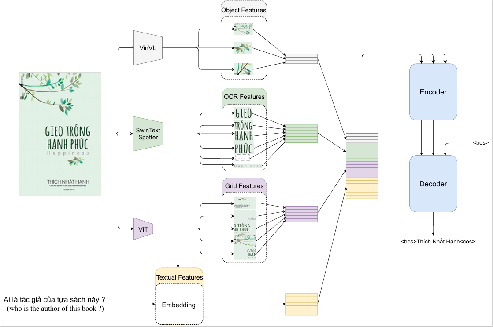

# VisionReader


Welcome to the VisionReader repository! This repository contains the implementation methods for the Optical Character Recognition - Visual Question Answering (OCR-VQA) task, particularly focusing on the Vietnamese language.

## Introduction

Optical Character Recognition - Visual Question Answering (OCR-VQA) is a challenging task that involves answering questions based on text information contained in images. While significant progress has been made in English-language OCR-VQA, there remains a gap in research for low-resource languages like Vietnamese. To address this gap, we present the ViOCRVQA (Vietnamese Optical Character Recognition - Visual Question Answering) dataset and VisionReader.

### ViOCRVQA Dataset

The ViOCRVQA dataset comprises over 28,000 images and 120,000 question-answer pairs in Vietnamese. Each image in the dataset contains text, and the questions are designed to test understanding of the information conveyed by the text in the images. This dataset provides a valuable resource for exploring OCR-VQA tasks in the Vietnamese language.

the dataset folders will have the following structure:

```angular2html

-- data
  |-- images
  |  |-- 000000000001.jpg
  |  |-- ...
  |-- train.json
  	|-- 
		{
			"images": [
				{
					"id": 68857,
					"filename": "000000068857.jpg",
					"filepath": "train"
				},...
			]
			"annotations": [
                {
                    "id": 5253,
                    "image_id": 482062,
                    "question": "cái gì trên đỉnh đồi cỏ nhìn lên bầu trời xanh sáng",
                    "answers": [
                        "ngựa vằn"
                    ]
                },...
            ]
		}
	
  |-- dev.json
	   |--
	
  |-- test.json
       |--

```

## Approach

In this repository, we introduce a novel approach called VisionReader, specifically tailored for the OCR-VQA task in Vietnamese. We leverage ideas from state-of-the-art methods developed for English-language OCR-VQA and adapt them to the unique challenges presented by the Vietnamese language.

### Performance

Our VisionReader achieves promising results on the ViOCRVQA dataset, with an Exact Match (EM) score of 0.4116 and an F1-score of 0.6990 on the test set. These results demonstrate the effectiveness of our approach in addressing the challenges inherent in a ViOCRVQA dataset.

## Key Insights

Through our experiments, we gained valuable insights into the factors influencing performance on the OCR-VQA task in Vietnamese. We found that the quality of the OCR system significantly impacts the performance of VQA models on the ViOCRVQA dataset. Additionally, considering objects in the image alongside text information can further improve model performance.


## Getting Started

To get started with VisionReader VQA, follow these steps:

1. Clone the repository:
   ```
   !git clone https://github.com/minhquan6203/VisionReader
   ```

2. Install dependencies:
   ```
   !pip install -r requirements.txt
   ```

3. Training:
   ```
   !python VisionReader/src/main.py --config VisionReader/config/visionreader_t5_config.yaml
   ```

4. Inference:
   ```
   !python VisionReader/src/main.py --config VisionReader/config/visionreader_t5_config.yaml
   ```
## Contribution

We welcome contributions from the community to further advance research in OCR-VQA tasks, particularly in low-resource languages like Vietnamese. Feel free to explore the dataset, experiment with the VisionReader, and contribute improvements or extensions to the repository.

## Citation

If you use the ViOCRVQA dataset or the VisionReader in your research, please cite our article (preprint):

[ViOCRVQA: Novel Benchmark Dataset and Vision Reader for Visual Question Answering by Understanding Vietnamese Text in Images](link)

## Authors

- Huy Quang Pham
  - Email: [21522163@gm.uit.edu.vn](mailto:21522163@gm.uit.edu.vn)

- Thang Kien-Bao Nguyen
  - Email: [21521432@gm.uit.edu.vn](mailto:21521432@gm.uit.edu.vn)

- Quan Van Nguyen
  - Email: [21521333@gm.uit.edu.vn](mailto:21521333@gm.uit.edu.vn)

- Dan Quang Tran
  - Email: [21521917@gm.uit.edu.vn](mailto:21521917@gm.uit.edu.vn)

- BS Nghia Hieu Nguyen
  - Email: [nghiangh@uit.edu.vn](mailto:nghiangh@uit.edu.vn)

- MSc Kiet Van Nguyen
  - Email: [kietnv@uit.edu.vn](mailto:kietnv@uit.edu.vn)

- Assoc. Prof Ngan Luu-Thuy Nguyen
  - Email: [ngannlt@uit.edu.vn](mailto:ngannlt@uit.edu.vn)

### Affiliations

- Faculty of Information Science and Engineering, University of Information Technology
- Vietnam National University, Ho Chi Minh City, Vietnam

## Contact

For any inquiries or feedback regarding the VisionReader, please contact  [21521333@gm.uit.edu.vn](mailto:21521333@gm.uit.edu.vn) or [21522163@gm.uit.edu.vn](mailto:21522163@gm.uit.edu.vn).
